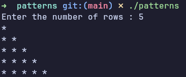

# Star Pattern Program in C

## Description
This is a basic C program that prints star (`*`) patterns using nested loops.
It is designed for beginners to understand looping concepts in C programming.

The program prints a simple star pattern such as a right-angled triangle.

## Concepts Learned 
This program thought me how to run loops and nested loops 
and how to get input form user using scan

## Output

